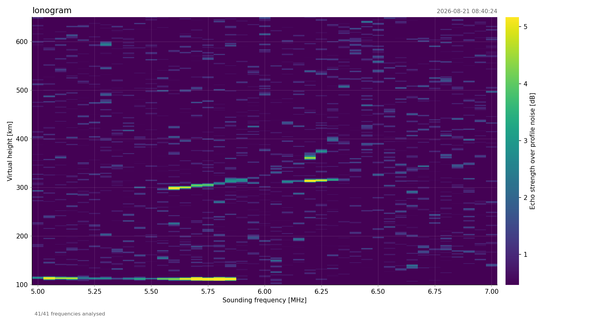

# BPSK Digital Ionosonde

A low-cost digital ionosonde built around a Raspberry Pi Pico. The RP2040 generates
BPSK-coded HF pulses straight into an 8-bit R-2R DAC, sequences the T/R chain, and a
Python runner records the frame with an RTL-SDR and turns it into a range profile or a
full ionogram.


*2–10 MHz sweep, 100 kHz steps, 81 frequencies. The F-region trace leaves 300 km at
5.2 MHz, the O and X branches separate above 5.6 MHz and both turn vertical between
5.9 and 6.3 MHz.*

**Ionospheric echoes, O/X splitting, second-hop returns and complete ionograms have all
been recorded with this hardware.**

## Overview

| | |
|---|---|
| Waveform | BPSK, Barker 2…13 or an arbitrary bit string, 40 µs/bit |
| Synthesis | 1440-point sine LUT, Q32 phase accumulator, **250 MS/s** into the DAC |
| Timing | PIO + DMA, no CPU in the sample path |
| Frequency | 1–12 MHz measured, 7.022 MHz default |
| Output | ~1.6 W peak into 50 Ω, flat within 0.2 dB from 3 to 12 MHz |
| Receiver | RTL-SDR v3 in direct sampling (Q branch); native Pico RX is planned |
| Processing | Coherent integration + matched filter, single profile or swept ionogram |

## Hardware

### Block diagram

```
┌──────────────────────────────────────────────────────────────────────┐
│  Raspberry Pi Pico (RP2040 @ 250 MHz)                                │
│                                                                      │
│  ┌──────────┐    ┌─────────┐    ┌────────────┐    ┌──────────┐       │
│  │ GP8-GP15 │───>│  8-bit  │───>│  2-stage   │───>│   T/R    │──-─> ANT
│  │  (PIO)   │    │ R-2R DAC│    │    PA      │    │  Switch  │       │
│  └──────────┘    └─────────┘    └────────────┘    └──────────┘       │
│                                       │                │             │
│                          GP4 (PA_EN) -┘                │             │
│                          GP3 (TR_SW) ------------------┘             │
│                          GP2 (RX_EN) ----------------------> RX      │
└──────────────────────────────────────────────────────────────────────┘
```

### Components

| Component | Part | Function |
|-----------|------|----------|
| MCU | Raspberry Pi Pico | Signal generation, timing control |
| DAC | 8-bit R-2R ladder | Digital to analog conversion (GP8–GP15) |
| Driver | SBB5089Z | MMIC preamplifier stage |
| Final PA | RD01MUS2B | 1.5 W RF power MOSFET |
| T/R switch | PE42553B | SPDT antenna switch |

### GPIO

| Pin | Function | Description |
|-----|----------|-------------|
| GP2 | RX_EN | RX preamplifier enable (HIGH = ON) |
| GP3 | TR_SW | T/R switch control (HIGH = TX, LOW = RX) |
| GP4 | PA_EN | Power amplifier enable (HIGH = ON) |
| GP8–GP15 | DAC | 8-bit R-2R DAC output |

## Measurements

All curves below were swept from 3 to 12 MHz in 500 kHz steps; the scope captures are
single acquisitions at the frequency named in the caption.

### Transmitted waveform

The DDS output measured open-circuit at the DAC, before the amplifier.


*Start of a pulse, 6 MHz. Envelope fade-in ≈ 2 µs.*


*Code transition, 1 MHz. Dotted trace = unmodulated carrier. Soft phase window ≈ 2 µs.*


*Whole chip, 1.5 MHz: 13 × 40 µs = 520 µs. Lower panel is the demodulated phase;
recovered sequence `+ + + + + − − + + − + − +`.*


*Same pulse, 10 MHz. Harmonics 2f₀…5f₀ at −45 to −53 dB; first nulls of the main lobe at
±1/T_c = ±25 kHz.*

### DDS output level and distortion (open circuit)


*1.34 V at 3 MHz to 0.57 V at 12 MHz. THD below 1 % up to 11 MHz, 1.3 % at 12 MHz.*

### DDS into a 50 Ω load


*−12.3 dBm at 3 MHz to −13.1 dBm at 12 MHz — 0.8 dB across the band. THD below 1 %.*

### Power amplifier into a 50 Ω load


*32.0 dBm (1.6 W), flat within ±0.1 dB from 3 to 12 MHz; 44.6 dB of gain over the DDS
measured at the same points. THD 35 % at 3 MHz falling to 21 % at 12 MHz.*

### T/R sequencer


*Five consecutive chips at the 5 ms chip interval: RF, RX_EN, TR_SW and PA_EN on the same
time base.*


*One chip. RX_EN off at −200 µs, T/R to TX at −150 µs, PA on at −100 µs, 520 µs of RF,
then the three signals release in reverse order.*

The offsets are firmware constants and can be changed over the serial link:

```
Time:   -200us   -150us   -100us    0      [TX]    +10us   +40us   +60us
          |        |        |       |                |        |       |
          v        v        v       v                v        v       v
        RX OFF   TR->TX   PA ON   START           PA OFF   TR->RX   RX ON
```

## Results

### Ionospheric echoes


*512 chips, coherent batch 32. Two returns 28 km apart at 250 and 278 km virtual height:
the ordinary and extraordinary magnetoionic components of the same echo.*


*2024 chips, coherent batch 8. The O/X pair sits at 258/272 km and the second hop —
the same energy after another ground and ionosphere reflection — appears at 550 km,
almost exactly twice the height.*


*2048 chips, coherent batch 256. The echo reaches 32 dB over the profile noise at 248 km
and the second hop still gives 20 dB at 500 km. The regular structure ±12 chips around
the main peak is the Barker-13 range sidelobe pattern, measured 22 dB below the peak —
the theoretical value for a 13-element Barker code is 20·log₁₀(13) = 22.3 dB.*

### Ionograms


*Two sweeps 27 minutes apart on the same morning (2026-08-22, 08:16 and 08:43 UTC). The
F-region trace flattens near 300 km, then the critical frequency climbs as the layer
ionises — the vertical cusp moves from about 6.0 MHz to about 6.6 MHz between the two
maps.*



*2026-08-21 08:40 UTC, 5–7 MHz in 50 kHz steps. Both layers at once: sporadic E flat at
110 km out to 5.85 MHz — thin enough to let the F echoes through — and the F trace from
300 km at 5.55 MHz rising to 310 km at 6.4 MHz. Near 6.2 MHz the F trace splits into its
O and X components, the X branch 50–65 km higher at 355–375 km.*


*2026-08-21 17:39 UTC. A blanketing sporadic-E layer at 100 km reflecting from 5 to
7.2 MHz, with the second hop at 200 km and the third at 300 km stacked above it.*

## Signal generation

The RP2040 runs at 250 MHz and the DAC is fed at the full system clock: a Q32 phase
accumulator steps through a 1440-point sine LUT, PIO shifts the bytes out on GP8–GP15
and DMA keeps it fed, so no interrupt or CPU stall can jitter a sample. Phase reversals
and the pulse envelope are baked into the sample stream rather than switched in hardware.

## Software


| File | Role |
|------|------|
| `ionosonde_auto_gui.py` | GUI over the whole loop — parameters, live progress, plot history, colour sliders |
| `ionosonde_auto.py` | The runner: keys the Pico, records with the RTL-SDR, calls the analysis |
| `ionogram.py` | Sweep analysis, frequency vs virtual height map, re-plotting from saved data |
| `corr/radar_corr_autoprobe.py` | Correlation / coherent integration of a single capture |

### Build the firmware

```bash
cd build
cmake ..
make
picotool load pico_digisonde.elf -fx
```

## Files

`ionosonde_auto_gui.py` is the only program you start; it imports the other three, so
none of them is optional.

```
├── ionosonde_auto_gui.py   # <- start here: GUI over the whole loop
│   ├── ionosonde_auto.py   #    keys the Pico, records with the RTL-SDR, runs a sweep
│   └── ionogram.py         #    sweep analysis + frequency vs virtual height map
│       └── corr/radar_corr_autoprobe.py   # correlation / coherent integration
│
├── main.c                  # Firmware: serial command interface, sequencer offsets
├── bpsk_tx.c / bpsk_tx.h   # BPSK transmitter: DDS, LUT, PIO/DMA, GPIO events
├── CMakeLists.txt          # Build configuration
└── img/                    # Measurement plots and documentation images
```

## Requirements

- Raspberry Pi Pico, Pico SDK 2.x
- Python 3 with `pyserial`, `numpy`, `scipy`, `matplotlib`
- RTL-SDR v3 (direct sampling) with SoapySDR for the receive side
- Optional: `PIL` for nicer plot scaling in the GUI, `picotool` for firmware recovery

## Author

SP8ESA

## License

CC BY-NC 4.0 (Creative Commons Attribution-NonCommercial 4.0)
