# BPSK Digital Ionosonde

A low-cost digital ionosonde built around a Raspberry Pi Pico. The RP2040 generates
BPSK-coded HF pulses straight into an 8-bit R-2R DAC, sequences the T/R chain, and a
Python runner records the frame with an RTL-SDR and turns it into a range profile or a
full ionogram.

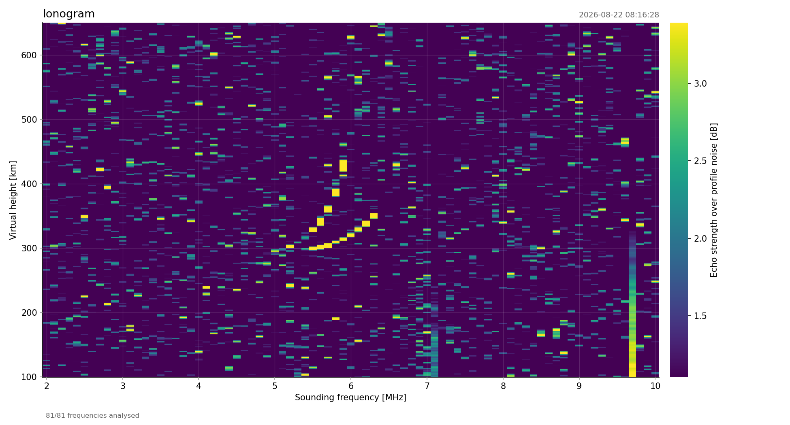

*2–10 MHz sweep, 100 kHz steps, 81 frequencies. The F-region trace leaves 300 km at
5.2 MHz, the O and X branches separate above 5.6 MHz and both turn vertical between
5.9 and 6.3 MHz.*

**Ionospheric echoes, O/X splitting, second-hop returns and complete ionograms have all
been recorded with this hardware.**

## Overview

| | |
|---|---|
| Waveform | BPSK, Barker 2…13 or an arbitrary bit string, 40 µs/bit |
| Synthesis | 1440-point sine LUT, Q32 phase accumulator, **250 MS/s** into the DAC |
| Timing | PIO + DMA, no CPU in the sample path |
| Frequency | 1–12 MHz measured, 7.022 MHz default |
| Output | ~1.6 W peak into 50 Ω, flat within 0.2 dB from 3 to 12 MHz |
| Receiver | RTL-SDR v3 in direct sampling (Q branch); native Pico RX is planned |
| Processing | Coherent integration + matched filter, single profile or swept ionogram |

## Hardware

### Block diagram

```
┌──────────────────────────────────────────────────────────────────────┐
│  Raspberry Pi Pico (RP2040 @ 250 MHz)                                │
│                                                                      │
│  ┌──────────┐    ┌─────────┐    ┌────────────┐    ┌──────────┐       │
│  │ GP8-GP15 │───>│  8-bit  │───>│  2-stage   │───>│   T/R    │──-─> ANT
│  │  (PIO)   │    │ R-2R DAC│    │    PA      │    │  Switch  │       │
│  └──────────┘    └─────────┘    └────────────┘    └──────────┘       │
│                                       │                │             │
│                          GP4 (PA_EN) -┘                │             │
│                          GP3 (TR_SW) ------------------┘             │
│                          GP2 (RX_EN) ----------------------> RX      │
└──────────────────────────────────────────────────────────────────────┘
```

### Components

| Component | Part | Function |
|-----------|------|----------|
| MCU | Raspberry Pi Pico | Signal generation, timing control |
| DAC | 8-bit R-2R ladder | Digital to analog conversion (GP8–GP15) |
| Driver | SBB5089Z | MMIC preamplifier stage |
| Final PA | RD01MUS2B | 1.5 W RF power MOSFET |
| T/R switch | PE42553B | SPDT antenna switch |

### GPIO

| Pin | Function | Description |
|-----|----------|-------------|
| GP2 | RX_EN | RX preamplifier enable (HIGH = ON) |
| GP3 | TR_SW | T/R switch control (HIGH = TX, LOW = RX) |
| GP4 | PA_EN | Power amplifier enable (HIGH = ON) |
| GP8–GP15 | DAC | 8-bit R-2R DAC output |

## Measurements

All curves below were swept from 3 to 12 MHz in 500 kHz steps; the scope captures are
single acquisitions at the frequency named in the caption.

### Transmitted waveform

The DDS output measured open-circuit at the DAC, before the amplifier.

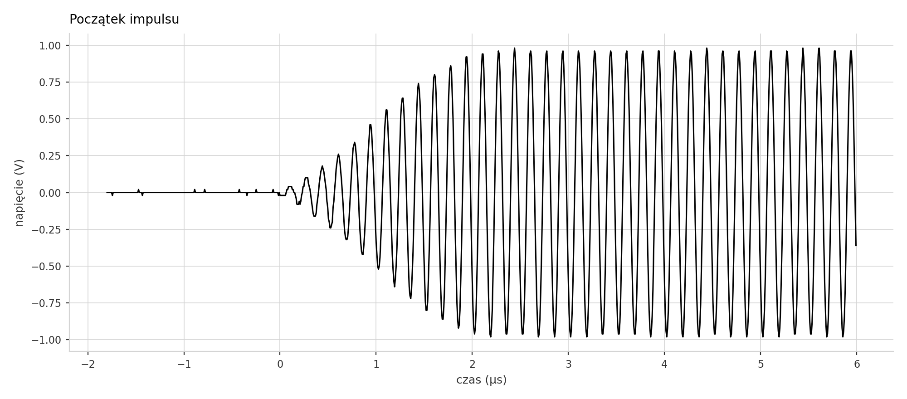

*Start of a pulse, 6 MHz. Envelope fade-in ≈ 2 µs.*

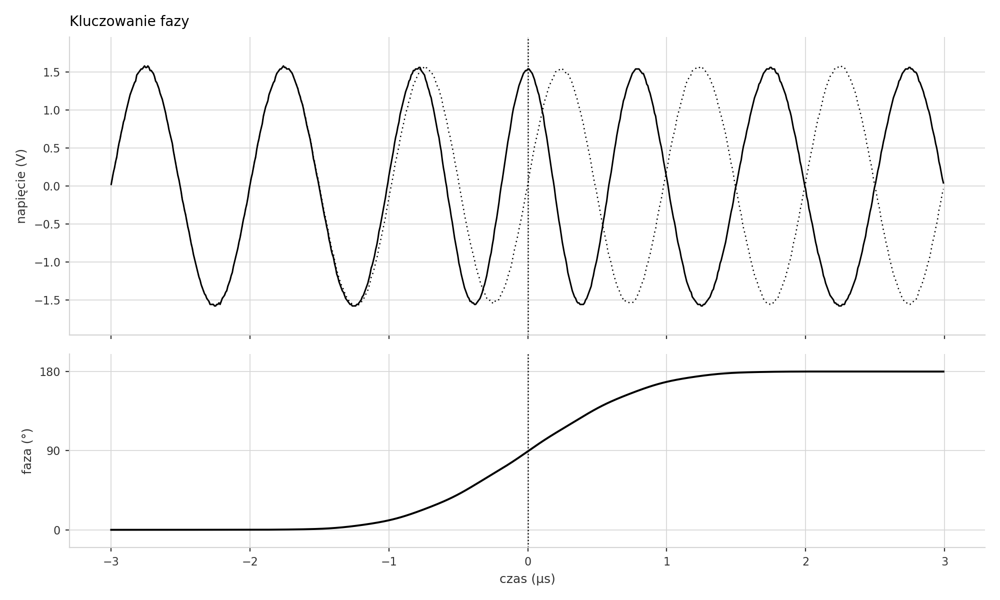

*Code transition, 1 MHz. Dotted trace = unmodulated carrier. Soft phase window ≈ 2 µs.*

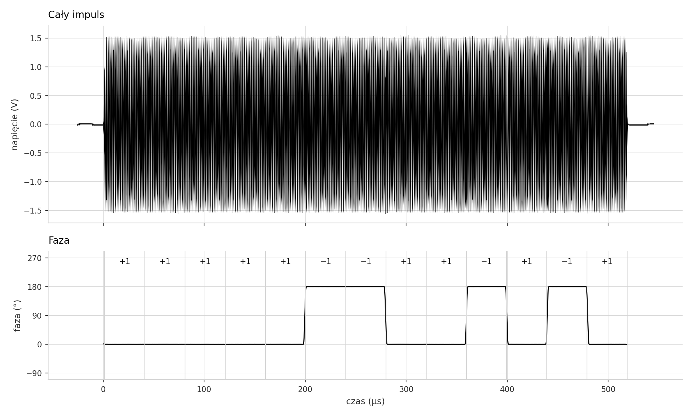

*Whole chip, 1.5 MHz: 13 × 40 µs = 520 µs. Lower panel is the demodulated phase;
recovered sequence `+ + + + + − − + + − + − +`.*

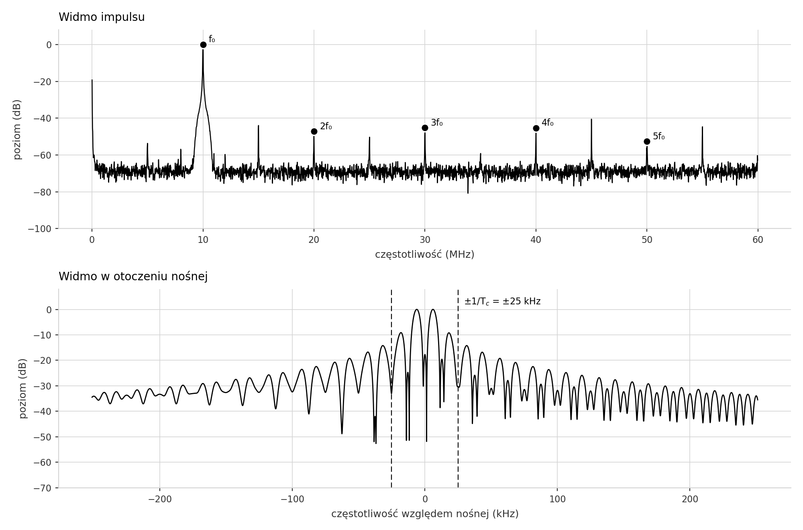

*Same pulse, 10 MHz. Harmonics 2f₀…5f₀ at −45 to −53 dB; first nulls of the main lobe at
±1/T_c = ±25 kHz.*

### DDS output level and distortion (open circuit)

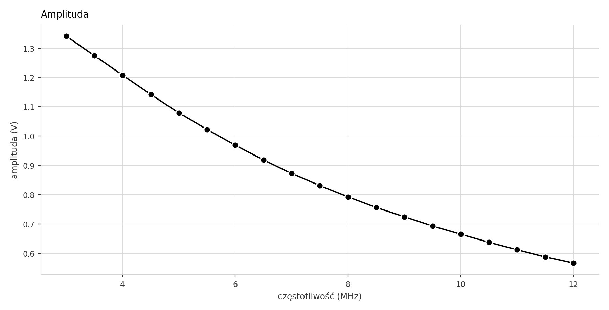
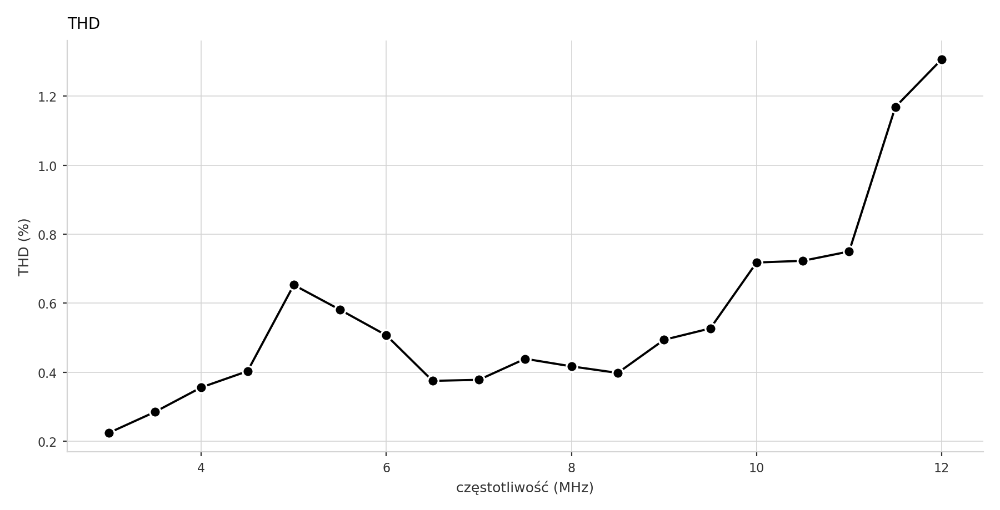

*1.34 V at 3 MHz to 0.57 V at 12 MHz. THD below 1 % up to 11 MHz, 1.3 % at 12 MHz.*

### DDS into a 50 Ω load

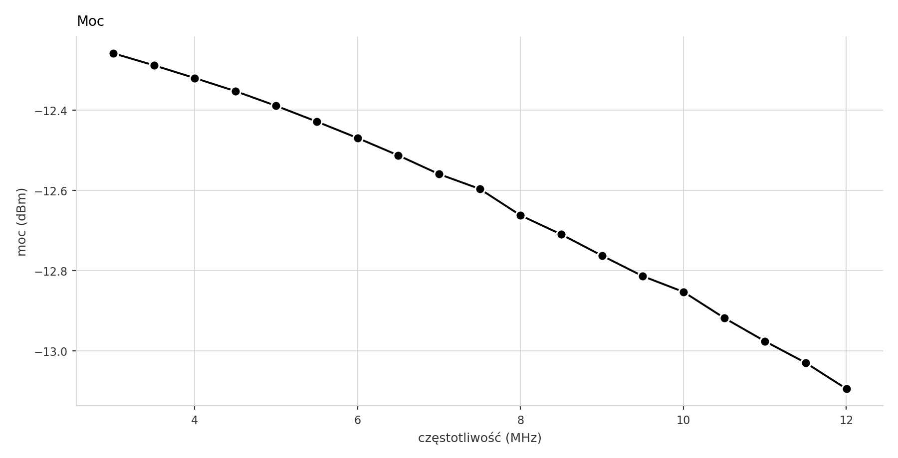
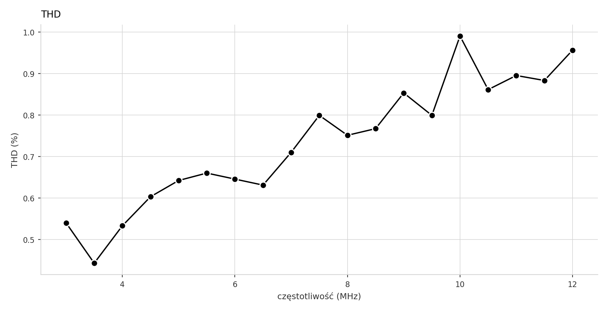

*−12.3 dBm at 3 MHz to −13.1 dBm at 12 MHz — 0.8 dB across the band. THD below 1 %.*

### Power amplifier into a 50 Ω load

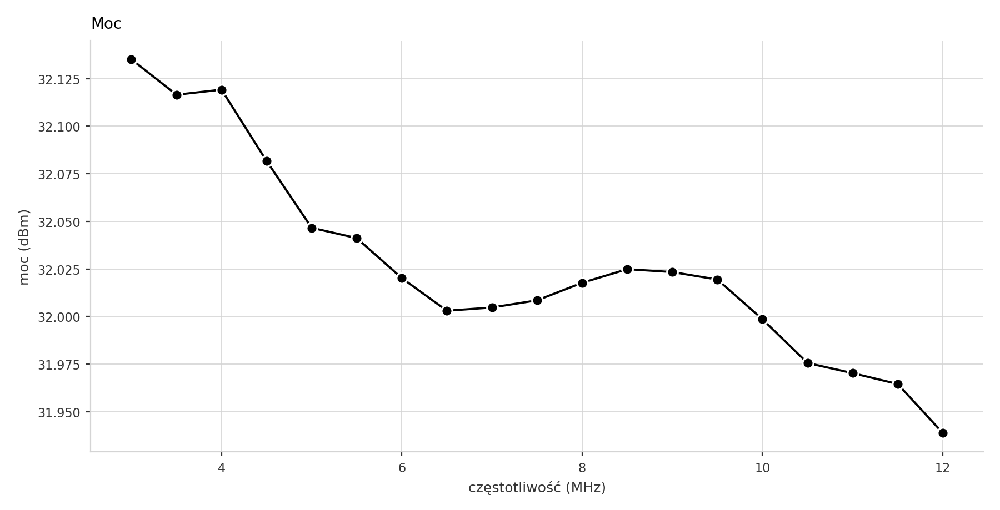
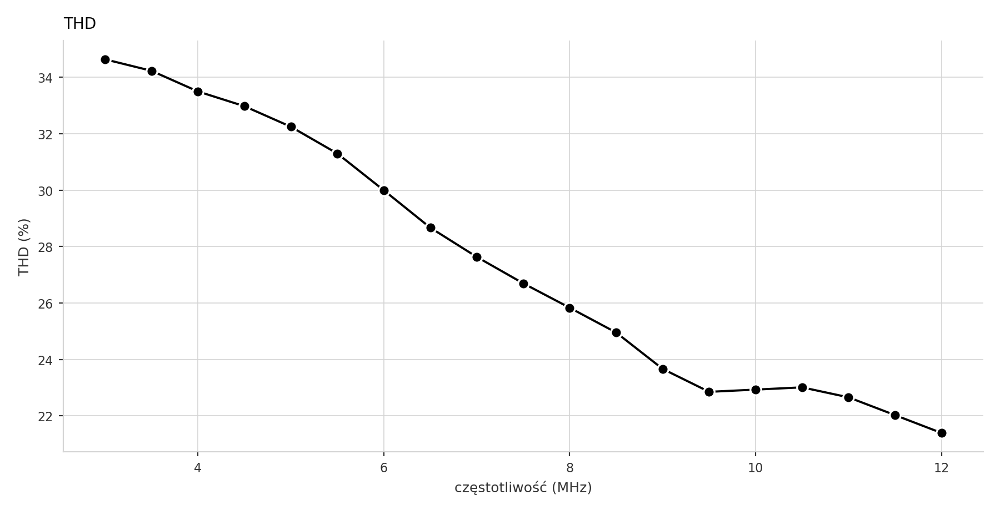

*32.0 dBm (1.6 W), flat within ±0.1 dB from 3 to 12 MHz; 44.6 dB of gain over the DDS
measured at the same points. THD 35 % at 3 MHz falling to 21 % at 12 MHz.*

### T/R sequencer

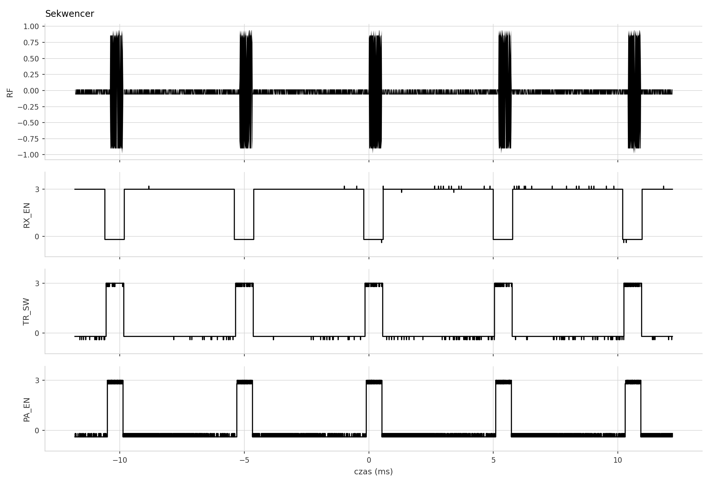

*Five consecutive chips at the 5 ms chip interval: RF, RX_EN, TR_SW and PA_EN on the same
time base.*

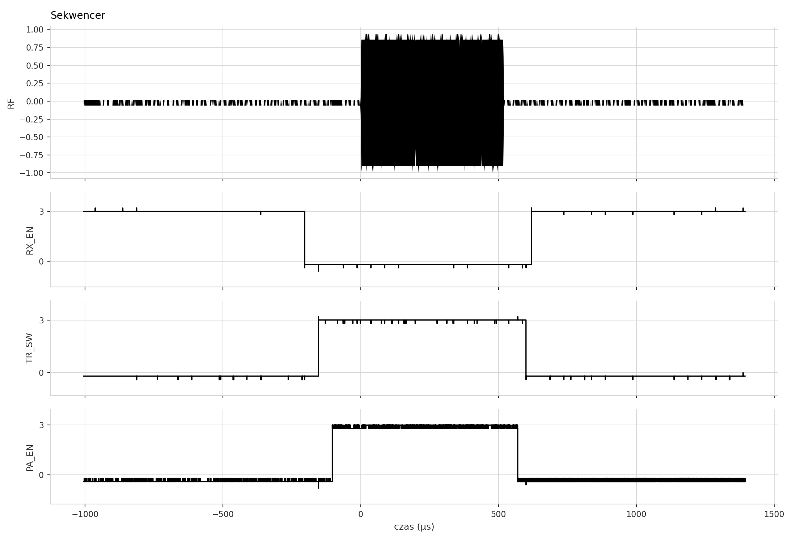

*One chip. RX_EN off at −200 µs, T/R to TX at −150 µs, PA on at −100 µs, 520 µs of RF,
then the three signals release in reverse order.*

The offsets are firmware constants and can be changed over the serial link:

```
Time:   -200us   -150us   -100us    0      [TX]    +10us   +40us   +60us
          |        |        |       |                |        |       |
          v        v        v       v                v        v       v
        RX OFF   TR->TX   PA ON   START           PA OFF   TR->RX   RX ON
```

## Results

### Ionospheric echoes

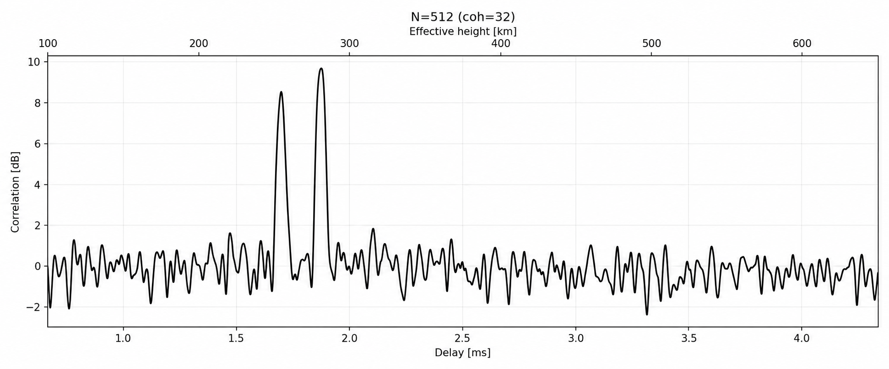

*512 chips, coherent batch 32. Two returns 28 km apart at 250 and 278 km virtual height:
the ordinary and extraordinary magnetoionic components of the same echo.*

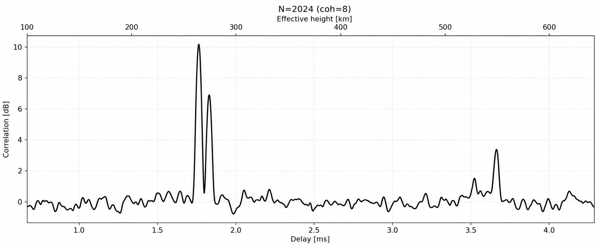

*2024 chips, coherent batch 8. The O/X pair sits at 258/272 km and the second hop —
the same energy after another ground and ionosphere reflection — appears at 550 km,
almost exactly twice the height.*

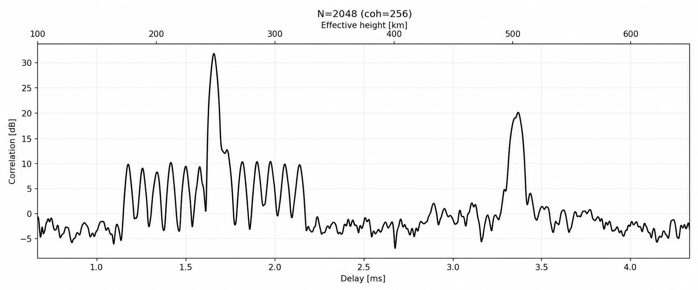

*2048 chips, coherent batch 256. The echo reaches 32 dB over the profile noise at 248 km
and the second hop still gives 20 dB at 500 km. The regular structure ±12 chips around
the main peak is the Barker-13 range sidelobe pattern, measured 22 dB below the peak —
the theoretical value for a 13-element Barker code is 20·log₁₀(13) = 22.3 dB.*

### Ionograms


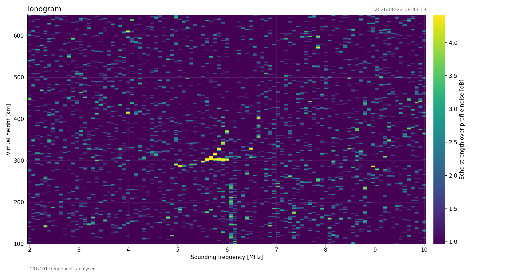

*Two sweeps 27 minutes apart on the same morning (2026-08-22, 08:16 and 08:43 UTC). The
F-region trace flattens near 300 km, then the critical frequency climbs as the layer
ionises — the vertical cusp moves from about 6.0 MHz to about 6.6 MHz between the two
maps.*

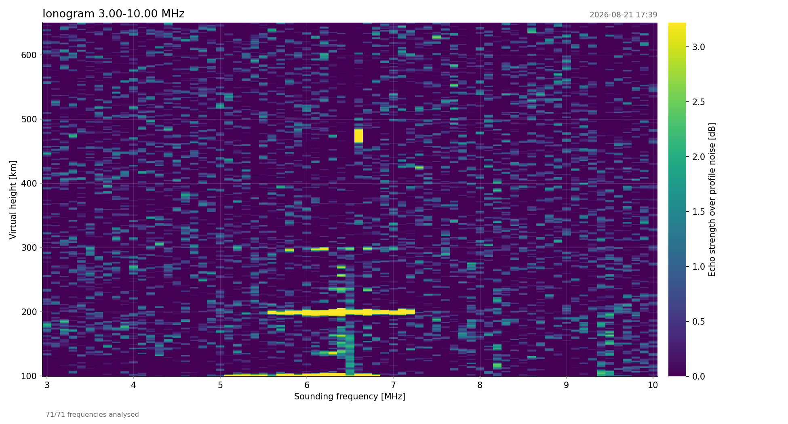

*2026-08-21 17:39 UTC. A blanketing sporadic-E layer at 100 km reflecting from 5 to
7.2 MHz, with the second hop at 200 km and the third at 300 km stacked above it.*

## Signal generation

The RP2040 runs at 250 MHz and the DAC is fed at the full system clock: a Q32 phase
accumulator steps through a 1440-point sine LUT, PIO shifts the bytes out on GP8–GP15
and DMA keeps it fed, so no interrupt or CPU stall can jitter a sample. Phase reversals
and the pulse envelope are baked into the sample stream rather than switched in hardware.

## Software

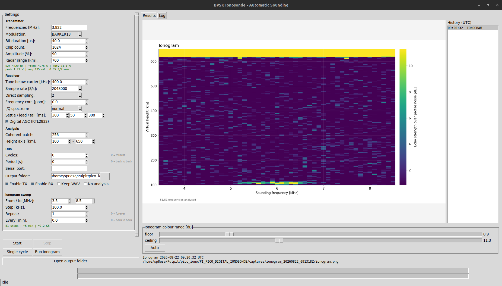

| File | Role |
|------|------|
| `ionosonde_auto_gui.py` | GUI over the whole loop — parameters, live progress, plot history, colour sliders |
| `ionosonde_auto.py` | The runner: keys the Pico, records with the RTL-SDR, calls the analysis |
| `ionogram.py` | Sweep analysis, frequency vs virtual height map, re-plotting from saved data |
| `corr/radar_corr_autoprobe.py` | Correlation / coherent integration of a single capture |

### Build the firmware

```bash
cd build
cmake ..
make
picotool load pico_digisonde.elf -fx
```

### Unattended sounding

`ionosonde_auto.py` closes the loop: it keys the Pico, records the frame with an
RTL-SDR and runs the correlation analysis, over and over.

```bash
sudo apt install python3-soapysdr soapysdr-module-rtlsdr
sudo modprobe -r dvb_usb_rtl28xxu rtl2832_sdr rtl2832   # free the dongle

python3 ionosonde_auto_gui.py                           # GUI (recommended)
python3 ionosonde_auto.py --no-tx                       # check RX only
python3 ionosonde_auto.py                               # 7.022 MHz, forever
python3 ionosonde_auto.py --freqs 3.655,7.022 --period 60 --cycles 40
```

The GUI exposes the same parameters, runs the loop in the background and shows each
finished range plot as soon as it is ready, with a clickable history of all cycles from
the session.

The RTL-SDR runs in **direct sampling mode on the Q-branch** (`--direct-samp 2`, the HF
input of RTL-SDR v3) and is tuned **below** the carrier (`--offset-khz`, default 50 kHz),
so the sounding signal sits away from the receiver's DC spike instead of on top of it.
Each cycle writes `captures/baseband_<center>Hz_<HH-MM-SS>_<DD-MM-YYYY>.wav` (stereo I/Q,
matching the format `corr/radar_corr_autoprobe.py` expects), a `.json` with capture
metrics, and the resulting `*_coh.png` range plot. The raw WAV is deleted after a
successful analysis unless `--keep-wav` is given.

| Option | Default | Description |
|--------|---------|-------------|
| `--freqs` | 7.022 | Carrier list in MHz, swept in order |
| `--offset-khz` | 50 | How far below the carrier the SDR is tuned |
| `--rate` | 250000 | RTL-SDR sample rate (225–300 kS/s or 0.9–3.2 MS/s) |
| `--direct-samp` | 2 | 0 = off, 1 = I-branch, 2 = Q-branch |
| `--iq-sense` | normal | Spectrum orientation (`auto` flips it if inverted) |
| `--period` | 0 | Seconds between cycle starts (0 = back to back) |
| `--cycles` | 0 | Number of cycles, 0 = run forever |
| `--tx` / `--no-tx` | on | Key the Pico; off = listen only |
| `--rx` / `--no-rx` | on | Record and analyse; off = transmit without opening the SDR |
| `--range-km` | 780 | Unambiguous radar range; the chip interval follows from it |
| `--chip-overhead-us` | 250 | Per-chip firmware overhead added to the interval |
| `--digital-agc` | **on** | RTL2832 digital AGC — the only gain that acts in direct sampling; `--no-digital-agc` turns it off |

### Range, power and energy

The chip interval is not set directly — you set the **radar range** you want to be
unambiguous, and the interval follows from the two-way travel time (minus the firmware
overhead). The GUI shows what that costs on air:

```
Chip interval 4954 us  ->  frame 10.66 s, 2048 x 520 us on air (10.0 % duty)
Peak 1.22 W   mean 121 mW   energy 1.29 J per frame
```

The budget assumes the nominal 1.5 W in the pulse at 100 % DAC amplitude and power
following the square of the amplitude, so 90 % is 1.22 W; the measured output above is
about 1.6 W, so the numbers on screen are the conservative ones. Energy is peak × chip
length × chips, and the mean power is that energy spread over the whole frame.

### Watchdog on the transmitter

Between frames the runner asks the Pico for `STATUS` and checks that the device node
still exists — an already-open handle keeps accepting writes after the board is
unplugged, so a silent link otherwise looks healthy. A frame that starts with no
`[TX-n] Started` is checked immediately and **aborted**, instead of writing 100 MB of
noise and finding out at the end.

Recovery then escalates until it works or the deadline passes:

1. reopen the port — fixes a stale handle, an unplug/replug, a self-reset;
2. **USB bus reset** on the board (`USBDEVFS_RESET`), which re-enumerates a wedged CDC.
   This needs write access to `/dev/bus/usb/...`; the RP2040 udev rule
   (`SUBSYSTEM=="usb", ATTR{idVendor}=="2e8a", MODE="0666"`) provides it;
3. `picotool reboot -f`, if picotool is installed — the only way to reboot the firmware
   itself.

A 1200-baud touch is deliberately not used: on a stock pico-sdk build it drops the board
into BOOTSEL and takes the sounder off the air until it is reflashed.

When a sweep loses its transmitter it now **revives it and redoes that very step**, so the
map keeps its frequency grid instead of ending short. `--max-recoveries` (default 3)
bounds how many times it may do that before giving up and keeping what it has.

### Enabling the two halves

TX and RX are two switches, both on by default — in the GUI **Enable TX** and **Enable
RX**, on the command line `--tx/--no-tx` and `--rx/--no-rx`:

| TX | RX | What happens |
|----|----|--------------|
| on | on | Normal sounding: key, record, analyse |
| on | off | Transmit and sequence only; **nothing opens the dongle**, so SDR#, gqrx or SDRuno can hold it and you watch the sounding live |
| off | on | Listen only; the Pico is not keyed — also how you check the receiver |
| off | off | Refused |

```bash
python3 ionosonde_auto.py --no-rx --freqs 3.822              # transmit, SDR free
python3 ionosonde_auto.py --no-tx                            # listen only
```

The GUI shows two progress bars: the top one is the job running right now (the frame
going out, a wait, an analysis), the bottom one is the position in the whole series —
sweep step 17/81, or file 9/64 being analysed, with an ETA.

With RX off, frame timing, T/R and PA sequencing, the frequency sweep and the progress
bars all behave as in a normal run; only recording and analysis are skipped. Stop ends it
after the current frame and sends `TX_STOP`. An ionogram needs the receiver, so it
refuses to start with RX off.

### Ionogram

A swept sounding that ends in a frequency vs virtual height map:

```bash
python3 ionosonde_auto.py --ionogram --ion-start 3 --ion-stop 8 --ion-step-khz 100
python3 ionogram.py captures/sweeps/sweep_20260822_081628Z   # re-analyse a finished sweep
```

The sweep **records every step first and analyses afterwards**, so the whole map
describes one state of the ionosphere instead of smearing the analysis time into it.
**Every finished map lands in one place** — `captures/ionograms/` — named by its UTC
start time, so the whole session sorts by name:

```
captures/
  ionograms/                     <- all the maps, side by side
    ionogram_20260822_081628Z.png
    ionogram_20260822_081628Z.npz
    ionogram_20260822_084313Z.png
  sweeps/                        <- the raw captures each map came from
    sweep_20260822_081628Z/
```

The `.npz` holds the raw matrix (`freqs_hz`, `km`, `db`) for your own plotting.

Ionograms can run one after another — layer heights and the top usable frequency change
over minutes, so a series shows the ionosphere moving:

```bash
python3 ionosonde_auto.py --ionogram --ion-repeat 0                # forever
python3 ionosonde_auto.py --ionogram --ion-repeat 12 --ion-period 30
```

In the GUI these are the **Ionogram repeat** and **Ionogram every [min]** fields. Each map
goes to its own timestamped folder and shows up in the history as soon as it is finished.
Stop ends the series after the current sweep, and anything already recorded stays on disk
— re-analyse it later with `python3 ionogram.py <folder>`.

Two sliders under the plot set the colour range (floor and ceiling in dB). They redraw
from the saved matrix — no re-analysis, ~0.1 s — so raising the floor to cut the noise and
leave only the trace is instant. **Auto** restores the computed levels. Same thing from
code:

```python
import ionogram
ionogram.replot("captures/ionograms/ionogram_20260822_081628Z.npz", vmin=25, vmax=45)
```

Every column is produced by the same chain as a single-frequency run, so a column is
exactly the curve from one `*_coh.png`, turned on its side and coloured. Frequencies where
no pulse was detected stay grey instead of aborting the sweep, and their raw I/Q is kept
so the step can be retried.

| Option | Default | Description |
|--------|---------|-------------|
| `--ion-start` / `--ion-stop` | 2 / 10 MHz | Sweep limits |
| `--ion-step-khz` | 100 | Step between soundings |
| `--ion-repeat` | 1 | Ionograms in a row, 0 = forever |
| `--ion-period` | 0 | Minutes between the START of consecutive ionograms |
| `--ion-km-min` / `--ion-km-max` | 100 / 650 | Height range of the map |

Cost scales with the sample rate: at 2.048 MS/s with 2048 chips one step is ~11 s of
recording (95 MB) and ~35 s of analysis, so a 51-step sweep takes roughly 10 min recording
plus 30 min analysis and 4.4 GB of scratch space (the WAVs are deleted as they are
analysed unless `--keep-wav`). The GUI shows this estimate next to the sweep settings
before you start.

### Pulse detection

The detector works in four steps:

1. **Isolate the band.** The capture can be 2 MHz wide while the sounding occupies
   ~50 kHz. It is mixed down by the known tuning offset, low-passed and decimated, so the
   analysis sees only our own signal — in a wide capture the sounding sits ~5 dB over the
   median while broadcasters reach +30 dB, which is why detecting on the raw band finds
   the wrong pulse or none at all.
2. **Match against the chip you transmit.** The template is generated from the Barker code
   and bit length, then refined by coherently averaging the strongest detected pulses, so
   it matches the real pulse shape. It is never cut out of the recording: the loudest
   sample in a wide capture is usually an interference spike, and a template like that
   smears the direct pulse into false echoes.
3. **Measure the period** from the envelope autocorrelation (sub-sample refined).
4. **Lay that grid over the frame** and snap each slot to its local matched-filter maximum,
   keeping the window of *N* consecutive slots with the most energy, where *N* is the
   transmitted chip count. Fading pulses keep their slot, so the number of integrated
   pulses always equals the number transmitted.

There is one detector and no switch for it: the band-isolating tracker above.

## Serial commands

| Command | Description |
|---------|-------------|
| TX_ONCE | Transmit single frame |
| TX_AUTO | Start automatic transmission |
| TX_STOP | Stop transmission |
| STATUS | Query current parameters |
| SET FREQ=7.022,... | Set parameters |

### Parameters

| Parameter | Default | Description |
|-----------|---------|-------------|
| Frequency | 7.022 MHz | Carrier frequency |
| Bit duration | 40 µs | Duration of each BPSK bit |
| Amplitude | 90 % | DAC output level (firmware powers up at 85 %) |
| Modulation | BARKER13 | Barker code selection |
| Chip count | 2048 | Chips per frame |
| Chip interval | 4975 µs | Start-to-start time between chips |
| Frame interval | 20000 ms | Auto-TX repetition rate |

## Files

`ionosonde_auto_gui.py` is the only program you start; it imports the other three, so
none of them is optional.

```
├── ionosonde_auto_gui.py   # <- start here: GUI over the whole loop
│   ├── ionosonde_auto.py   #    keys the Pico, records with the RTL-SDR, runs a sweep
│   └── ionogram.py         #    sweep analysis + frequency vs virtual height map
│       └── corr/radar_corr_autoprobe.py   # correlation / coherent integration
│
├── main.c                  # Firmware: serial command interface, sequencer offsets
├── bpsk_tx.c / bpsk_tx.h   # BPSK transmitter: DDS, LUT, PIO/DMA, GPIO events
├── CMakeLists.txt          # Build configuration
└── img/                    # Measurement plots and documentation images
```

## Project status

- [x] BPSK transmitter with PIO/DMA
- [x] GPIO sequencing for T/R and PA control
- [x] Bench characterisation of the DDS, PA and sequencer
- [x] Unattended TX/RX loop with transmitter watchdog
- [x] Ionospheric echo reception, O/X splitting and second hop confirmed
- [x] Swept ionograms and ionogram series
- [ ] Harmonic filter between PA and antenna
- [ ] Native RX receiver on the Pico
- [ ] Automatic trace scaling (foF2, h'F) from the ionogram

## Requirements

- Raspberry Pi Pico, Pico SDK 2.x
- Python 3 with `pyserial`, `numpy`, `scipy`, `matplotlib`
- RTL-SDR v3 (direct sampling) with SoapySDR for the receive side
- Optional: `PIL` for nicer plot scaling in the GUI, `picotool` for firmware recovery

## Author

SP8ESA

## License

CC BY-NC 4.0 (Creative Commons Attribution-NonCommercial 4.0)
