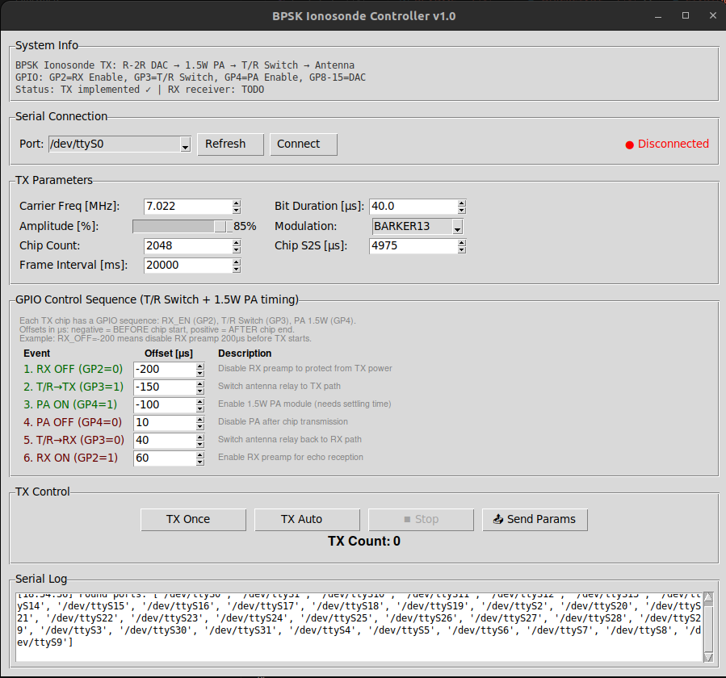
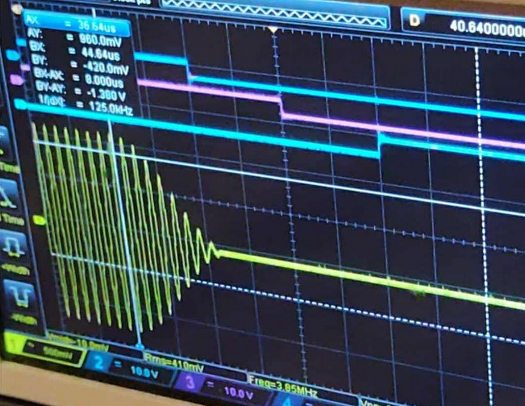
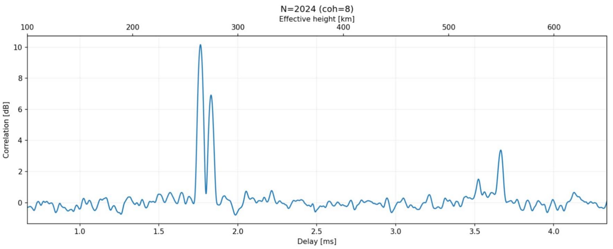

# BPSK Digital Ionosonde

A low-cost digital ionosonde based on Raspberry Pi Pico with BPSK modulation for ionospheric sounding.



## Overview

This project implements a complete ionosonde transmitter using a Raspberry Pi Pico microcontroller. The system generates BPSK-modulated pulses at HF frequencies and controls the RF chain timing for transmit/receive switching.

**Ionospheric echoes have been successfully received, showing O-mode and X-mode splitting.**

## Hardware

### Block Diagram

```
┌──────────────────────────────────────────────────────────────────────┐
│  Raspberry Pi Pico (RP2040 @ 250 MHz)                                │
│                                                                      │
│  ┌──────────┐    ┌─────────┐    ┌────────────┐    ┌──────────┐       │
│  │ GP8-GP15 │───>│  8-bit  │───>│  2-stage   │───>│   T/R    │──-─> ANT
│  │  (PIO)   │    │ R-2R DAC│    │    PA      │    │  Switch  │       │
│  └──────────┘    └─────────┘    └────────────┘    └──────────┘       │
│                                       │                │             │
│                          GP4 (PA_EN) -┘                │             │
│                          GP3 (TR_SW) ------------------┘             │
│                          GP2 (RX_EN) ----------------------> RX      │
└──────────────────────────────────────────────────────────────────────┘
```

### Components

| Component | Part Number | Function |
|-----------|-------------|----------|
| MCU | Raspberry Pi Pico | Signal generation, timing control |
| DAC | 8-bit R-2R Ladder | Digital to analog conversion (GP8-GP15) |
| Driver | SBB5089Z | MMIC preamplifier stage |
| Final PA | RD01MUS2B | 1.5W RF power MOSFET |
| T/R Switch | PE42553B | SPDT antenna switch |

### GPIO Pinout

| Pin | Function | Description |
|-----|----------|-------------|
| GP2 | RX_EN | RX preamplifier enable (HIGH = ON) |
| GP3 | TR_SW | T/R switch control (HIGH = TX, LOW = RX) |
| GP4 | PA_EN | Power amplifier enable (HIGH = ON) |
| GP8-GP15 | DAC | 8-bit R-2R DAC output |

## Signal Generation

The Pico generates BPSK-modulated signals using PIO and DMA for precise, jitter-free timing:



## Results

Ionospheric echoes showing O-mode and X-mode separation:



*Reception via SDRplay RSPduo. Native Pico RX implementation is planned.*

## Features

- BPSK modulation with selectable Barker codes (2, 3, 4, 5, 7, 11, 13)
- Configurable carrier frequency (default 7.022 MHz)
- 1.5W output power via 2-stage amplifier
- PIO + DMA for sample-accurate signal generation
- Python GUI with serial interface
- Precise GPIO sequencing for T/R switch and PA timing

## TX Timing Sequence

Each chip transmission follows this timing:

```
Time:   -200us   -150us   -100us    0      [TX]    +10us   +40us   +60us
          |        |        |       |                |        |       |
          v        v        v       v                v        v       v
        RX OFF   TR->TX   PA ON   START           PA OFF   TR->RX   RX ON
```

## Parameters

| Parameter | Default | Description |
|-----------|---------|-------------|
| Frequency | 7.022 MHz | Carrier frequency |
| Bit Duration | 40 us | Duration of each BPSK bit |
| Amplitude | 85% | DAC output level |
| Modulation | BARKER13 | Barker code selection |
| Chip Count | 2048 | Number of chips per frame |
| Chip Interval | 4975 us | Time between chip starts |
| Frame Interval | 20000 ms | Auto-TX repetition rate |

## Getting Started

### Build Firmware

```bash
cd build
cmake ..
make
```

### Flash Pico

```bash
picotool load pico_digisonde.elf -fx
```

### Run GUI

```bash
pip install pyserial
python3 ionosonde_gui.py
```

### Operation

1. Connect to serial port (typically /dev/ttyACM0 on Linux)
2. Adjust transmission parameters
3. Click "Send Params" to upload settings
4. Click "TX Once" for single transmission or "TX Auto" for continuous

## Serial Commands

| Command | Description |
|---------|-------------|
| TX_ONCE | Transmit single frame |
| TX_AUTO | Start automatic transmission |
| TX_STOP | Stop transmission |
| STATUS | Query current parameters |
| SET FREQ=7.022,... | Set parameters |

## Project Status

- [x] BPSK transmitter with PIO/DMA
- [x] GPIO sequencing for T/R and PA control
- [x] Python GUI controller
- [x] Ionospheric echo reception confirmed
- [ ] Native RX receiver (planned)
- [ ] Real-time ionogram display (planned)

## Files

```
├── main.c              # Main firmware
├── bpsk_tx.c           # BPSK transmitter library
├── bpsk_tx.h           # Header file
├── ionosonde_gui.py    # Python control GUI
├── CMakeLists.txt      # Build configuration
└── img/                # Documentation images
```

## Requirements

- Raspberry Pi Pico
- Pico SDK 2.x
- Python 3.x with pyserial

## Author

SP8ESA

## License

CC BY-NC 4.0 (Creative Commons Attribution-NonCommercial 4.0)
